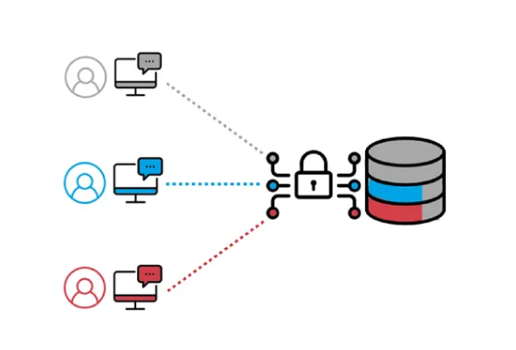

# Row Level Security (RLS)



This is a postgresql resource in which you can control the access to specific rows in a table based on different conditions.

Using this feature, we can control who are the ones who can view/modify rows.

## How is it done?

- enhanced security
- granular control

### Requirements

- PostgreSQL 9.5 or higher
- Access to a PostgreSQL instance with enough permissions to create tables, policies and users

### Tutorial

- Create an `employees` table

```sql
CREATE TABLE employees (
    id SERIAL PRIMARY KEY,
    name TEXT NOT NULL,
    department TEXT NOT NULL,
    salary NUMERIC NOT NULL,
    user_role TEXT NOT NULL  -- Usado para aplicar RLS
);
```

- add some `employee` data

```sql
INSERT INTO employees (name, department, salary, user_role) VALUES
('Alice', 'Engineering', 70000, 'engineer'),
('Bob', 'Engineering', 80000, 'engineer'),
('Charlie', 'HR', 60000, 'hr'),
('David', 'HR', 65000, 'hr'),
('Eve', 'Marketing', 70000, 'marketing');
```

- activate ROW-Level Security on that table 

```sql
ALTER TABLE employees ENABLE ROW LEVEL SECURITY;
```

- Create a new policy for that specific table

```sql
CREATE POLICY department_access_policy
ON employees
FOR SELECT
USING (department = current_user);
```